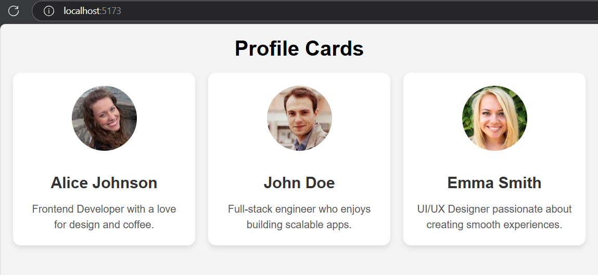

# Personal Profile Card

Objective: Learn the basics of React by building reusable components and passing data using props.

### Tasks:
Set up a React project using Vite. 
Create a functional component for a profile card. 
Use props to display a user's name, photo, and a short bio. 
Style the card using basic CSS. 

