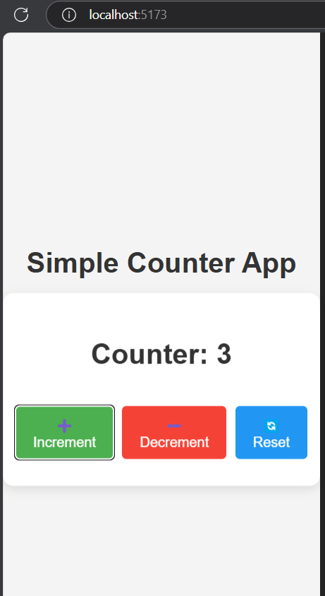

# Simple Counter App

Objective: Understand how to manage and update state dynamically in a React application.

### Tasks:
Create a functional component with a state variable for the counter. 
Add buttons to increment, decrement, and reset the counter. 
Display the counter value dynamically on the screen. 

